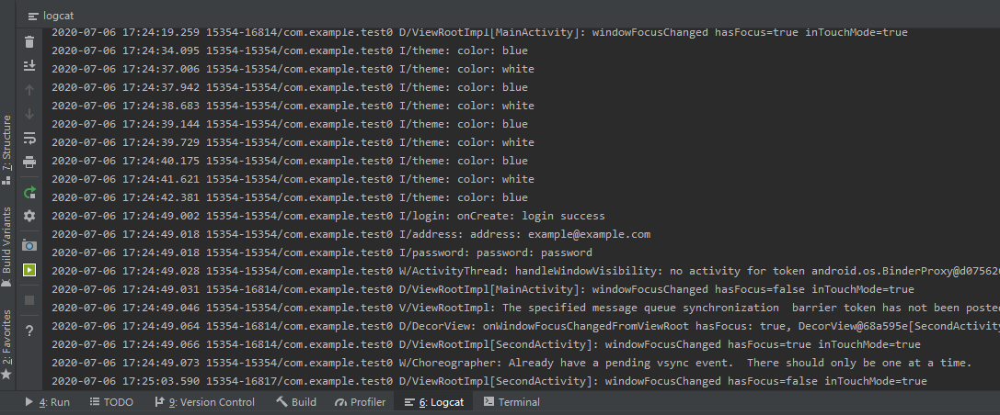
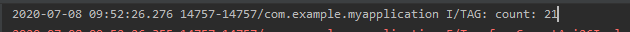

#### little-term

#### HW1:

**test0项目中登录账号为example@example.com，密码为password**

**log**

可以在image文件夹中查看其他图片

#### HW2:

**test2项目图片借用了ic_background和ic_foreground，点击上部四个按钮分别是不同的界面，但都是空界面。点击下面的聊天均会跳转到聊天界面，~~可发送消息~~（虚假的发送消息）。它们都是复用同一个界面，会从intent获取相关信息显示。同时也增加了 ViewNumCount.java完成exercise2。**

#### HW4:

